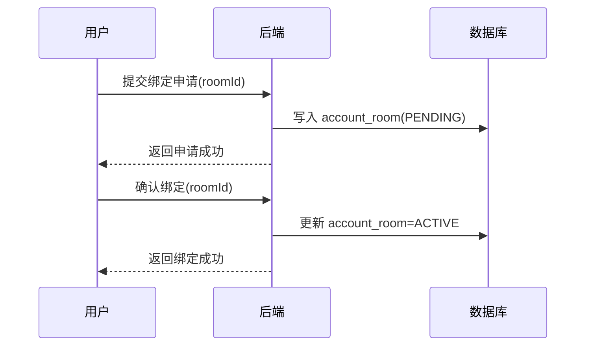
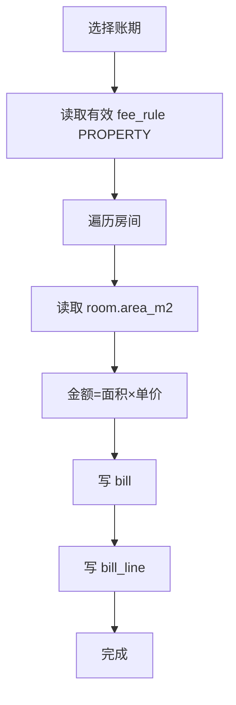
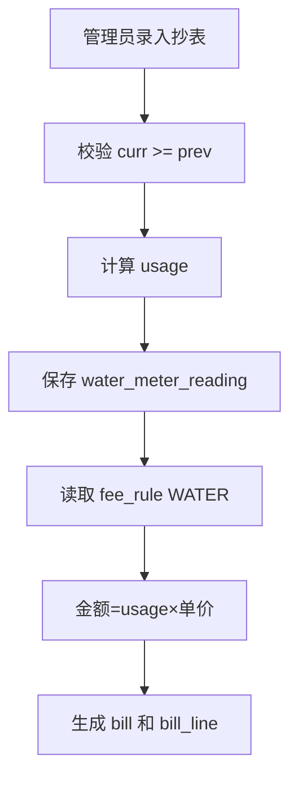
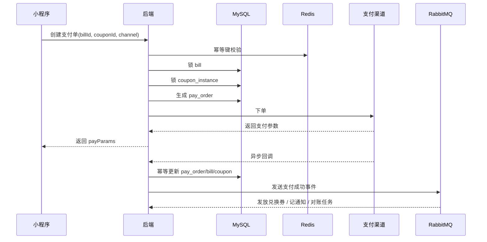

# 物业管理系统从零开发文档（V2）

> 适用对象：后端开发、前端开发、测试、项目负责人  
> 文档目标：基于现有材料，沉淀一份可直接指导从 0 到 1 搭建项目的“实施型开发文档”  
> 适用范围：Spring Boot + MyBatis + MySQL 8 + Redis + RabbitMQ，微信/支付宝小程序，微信/支付宝支付

---

## 1. 文档定位与设计原则

这份文档不是需求宣传稿，也不是单纯的接口清单，而是**从立项、建库、搭骨架、开发核心闭环到上线验收**都可以直接使用的实施文档。

### 1.1 文档解决的问题

现有几份材料已经覆盖了：
- 总体业务范围与系统架构
- 物业费按面积、水费按抄表的计费规则
- Resident / Agent / Admin 的接口边界
- 当前代码骨架已具备的能力与待补模块

但它们仍然分散在不同文件里，存在以下问题：
- 更像“方案说明”，不够像“开工手册”
- 有业务规则，但缺少从零搭建时的工程顺序
- 有表设计方向，但缺少统一的数据约束与落地原则
- 有接口示例，但缺少模块边界、事务边界、幂等策略、测试要点

### 1.2 本文档的统一原则

从现在开始，整个项目统一遵循以下 8 条原则：

1. **账单主体永远是房间（room）**，不是人。  
2. **一个房间可绑定多个账号**，多个账号共享同一账单与支付结果。  
3. **统计口径以房间为准**，避免一个住户多账号、多房屋造成偏差。  
4. **物业费按面积计费，水费按抄表计费**，两者都通过统一账单模型沉淀。  
5. **支付与账单解耦**：账单负责应收，支付单负责实收，渠道流水负责对账。  
6. **券系统独立建模**：支付前抵扣，支付后发券，核销独立留痕。  
7. **权限分两层**：RBAC 控制“能不能调接口”，数据范围控制“能看哪些数据”。  
8. **所有关键链路必须可审计、可重试、可幂等**。

---

## 2. 项目目标与范围

### 2.1 项目目标

搭建一套物业管理系统，支持以下核心能力：
- 住户绑定房间、查询账单、发起支付
- 物业费按面积生成账单
- 水费按抄表录入生成账单
- 微信/支付宝支付闭环
- Agent 按用户组查看组内缴费情况
- 管理员导入/导出账单、查看报表、配置计费规则和券规则
- 支持优惠券抵扣与支付后发放兑换券

### 2.2 本期范围（建议以 MVP -> P1 -> P2 推进）

### MVP（必须先跑通）
- 微信登录 / JWT 鉴权
- 房间绑定
- 物业费账单生成
- 水费抄表录入与账单生成
- 住户账单查询
- 单渠道支付闭环（建议先微信）
- 管理员月报表

### P1（增强）
- 支付宝支付
- 优惠券抵扣
- 支付后发券
- Agent 用户组报表
- CSV/Excel 导入导出

### P2（运营增强）
- 阶梯水价
- 异常用量预警
- 自动催缴
- 发票/电子凭证
- 更精细的组织架构与多租户

### 2.3 非目标（本期不建议一开始就做）
- 复杂 ERP/财务总账整合
- 业主报修/工单/巡检/门禁全家桶
- 多币种、多税制支付
- 大规模 SaaS 多租户隔离改造

---

## 3. 角色与权限模型

### 3.1 角色定义

| 角色 | 说明 | 数据范围 |
|---|---|---|
| Resident | 住户 | Self |
| Agent | 经办人 / 代理 / 片区人员 | Group |
| Admin | 管理员 | All |
| Finance | 财务（可选） | All / Org |

### 3.2 权限控制模型

权限控制拆成两层：

### 第一层：RBAC
控制“这个接口能不能调用”。

例如：
- `POST /api/v1/payments` 只允许 Resident
- `GET /api/v1/agent/reports/monthly` 只允许 Agent
- `POST /api/v1/admin/bills/generate/property` 只允许 Admin

### 第二层：数据范围
控制“调用成功后能看到哪些数据”。

| 数据范围 | 含义 |
|---|---|
| Self | 只能访问本人绑定房间的数据 |
| Group | 只能访问被授权用户组的数据 |
| All | 可访问全局数据 |

### 3.3 Agent 授权模型

Agent 不直接看全局数据，而是通过 `agent_group` 获得某些用户组的访问权。

建议权限级别：
- `VIEW`：只能查报表、账单状态、住户缴费情况
- `MANAGE`：除查看外，还能导出、发券、发起催缴等管理动作

---

## 4. 核心业务规则

### 4.1 房间与账号绑定规则

1. 一个账号可以绑定多个房间。
2. 一个房间可以绑定多个账号。
3. 账单按房间生成，不按账号生成。
4. 任意一个绑定该房间的账号支付成功后，其他绑定账号都应看到该账单已支付。
5. 房间绑定状态建议使用：
   - `PENDING`
   - `ACTIVE`
   - `INACTIVE`

### 4.2 物业费规则

物业费金额 = `面积 × 单价`

面积来源优先级：
1. `room.area_m2`
2. `house_type.area_m2_default`

规则要求：
- 金额统一保留两位小数
- 计费周期默认按月
- 后续可扩展为季度、半年、年，但底层仍建议统一到账期维度

### 4.3 水费规则

水费金额 = `用量 × 单价`

其中：
- `usage = curr_reading - prev_reading`
- `usage >= 0`

要求：
- 同一房间同一账期只能有一条抄表记录
- 抄表需记录抄表人、抄表时间、备注
- 可选保留照片证据

### 4.4 账单规则

账单建议按费用类型分单，不建议把物业费、水费混到一张主账单里，便于：
- 分别查询与统计
- 不同到期日处理
- 后续扩展不同券规则

推荐唯一约束：

```sql
UNIQUE(room_id, fee_type, period_year, period_month)
```

这条约束是整个项目最关键的业务约束之一。

### 4.5 支付规则

1. 一个账单可以关联多个支付尝试，但最终只能有一次成功支付。
2. 支付单独建模为 `pay_order`。
3. 渠道原始交互记录建模为 `pay_transaction`。
4. 支付回调必须幂等。
5. 已支付账单禁止直接修改金额；若需修正，走冲正 / 补差逻辑。

### 4.6 优惠券 / 兑换券规则

统一抽象为券系统，但区分两类：
- `PAYMENT`：支付前抵扣券
- `VOUCHER`：支付后发放的兑换券 / 服务券

券实例状态建议：
- `NEW`
- `LOCKED`
- `USED`
- `EXPIRED`
- `CANCELLED`

### 4.7 统计口径

所有报表默认以房间为统计主体：
- 缴费户数 = 成功缴费的房间数
- 总户数 = 该账期应收账单对应房间数
- 缴费率 = 缴费户数 / 总户数
- 实收金额 = 成功支付金额总和
- 抵扣金额 = 券抵扣金额总和
- 欠费金额 = 应收 - 实收

---

## 5. 系统总体架构

### 5.1 技术栈

### 后端
- Java 17
- Spring Boot 3.x
- MyBatis
- MySQL 8
- Redis
- RabbitMQ
- Maven

### 前端
- 微信小程序
- 支付宝小程序
- 管理后台（建议 Vue 3 + Element Plus，或你熟悉的 React）

### 基础设施
- Docker
- Nginx
- 对象存储（导出文件、抄表照片）
- 可选 Kubernetes

### 5.2 系统模块拆分

```text
wuye-system/
├── backend/
│   ├── wuye-api          # HTTP 接口层
│   ├── wuye-auth         # 登录、JWT、鉴权
│   ├── wuye-account      # 账号、身份、角色
│   ├── wuye-room         # 房间、绑定关系
│   ├── wuye-group        # 用户组、Agent 授权
│   ├── wuye-bill         # 账单、计费规则、抄表
│   ├── wuye-payment      # 支付单、渠道流水、支付网关
│   ├── wuye-coupon       # 券模板、券实例、核销
│   ├── wuye-report       # 报表与统计
│   ├── wuye-importexport # 导入导出
│   ├── wuye-common       # 公共响应、异常、枚举、工具类
│   └── wuye-audit        # 审计日志
├── admin-web/            # 管理后台
├── miniapp-wechat/       # 微信小程序
├── miniapp-alipay/       # 支付宝小程序
├── ops/
│   ├── docker-compose.yml
│   ├── sql/
│   ├── nginx/
│   └── scripts/
└── docs/
    ├── 开发文档.md
    ├── 接口文档.md
    ├── 数据字典.md
    └── 上线检查表.md
```

### 5.3 后端分层建议

每个业务模块统一分层：
- `controller`
- `service`
- `domain`
- `mapper`
- `entity`
- `dto`
- `vo`
- `convert`
- `enum`

这样后期维护成本最低，也利于多人协作。

---

## 6. 从零搭建的实施顺序

建议严格按下面顺序推进，否则很容易出现“接口写了很多，但闭环跑不通”的问题。

### 6.1 第 1 阶段：初始化工程与基础设施

交付物：
- Spring Boot 工程可启动
- MySQL / Redis / RabbitMQ 本地可用
- 基础配置分环境（dev/test/prod）
- 统一响应体与全局异常处理
- 日志配置完成

建议先完成：
1. 建立 Maven 多模块项目
2. 接入 MyBatis 与基础分页
3. 配置 Flyway 或 Liquibase（强烈建议）
4. 建立 `docker-compose.yml`
5. 建立统一异常码、统一响应结构

### 6.2 第 2 阶段：认证与权限

交付物：
- 微信登录 -> JWT
- JWT 拦截器 / 过滤器
- 角色与数据范围注解
- 当前用户上下文 `LoginUser`

建议完成：
- `AuthController`
- `JwtService`
- `AuthInterceptor`
- `@DataScope(Self/Group/All)`
- `PermissionEvaluator`

### 6.3 第 3 阶段：房间与用户组基础模型

交付物：
- 房间表、绑定表、组表、Agent 授权表
- `GET /me/rooms`
- 绑定 / 确认 / 解绑流程
- Group 授权校验可用

### 6.4 第 4 阶段：账单闭环

交付物：
- 物业费规则配置
- 物业费批量生成账单
- 水表配置
- 水表抄表录入
- 水费批量生成账单
- 住户账单列表与详情

### 6.5 第 5 阶段：支付闭环

交付物：
- `pay_order`
- 微信支付下单
- 微信回调
- 幂等处理
- 支付结果查询

说明：
建议先只接一个支付渠道，跑通再接第二个渠道。优先微信。

### 6.6 第 6 阶段：券系统

交付物：
- 券模板
- 券实例
- 券校验
- 支付前抵扣
- 支付后发券
- 核销记录

### 6.7 第 7 阶段：报表、导入导出与上线准备

交付物：
- Agent 报表
- Admin 报表
- 导入账单
- 导出账单
- 审计日志
- 监控告警
- 备份恢复演练

---

## 7. 本地开发环境与启动方式

### 7.1 依赖版本建议

| 组件 | 版本建议 |
|---|---|
| JDK | 17 |
| Maven | 3.9+ |
| MySQL | 8.0+ |
| Redis | 7.x |
| RabbitMQ | 3.12+ |
| Node.js | 18+ |

### 7.2 本地环境变量

建议配置：

```properties
SPRING_PROFILES_ACTIVE=dev
MYSQL_HOST=127.0.0.1
MYSQL_PORT=3306
MYSQL_DB=wuye
MYSQL_USER=root
MYSQL_PASSWORD=123456
REDIS_HOST=127.0.0.1
REDIS_PORT=6379
RABBITMQ_HOST=127.0.0.1
RABBITMQ_PORT=5672
JWT_SECRET=replace_me
WX_APP_ID=replace_me
WX_APP_SECRET=replace_me
WX_MCH_ID=replace_me
WX_API_V3_KEY=replace_me
ALIPAY_APP_ID=replace_me
ALIPAY_PRIVATE_KEY=replace_me
ALIPAY_PUBLIC_KEY=replace_me
FILE_ENDPOINT=replace_me
FILE_BUCKET=replace_me
```

### 7.3 Docker Compose 示例

```yaml
version: '3.9'
services:
  mysql:
    image: mysql:8.0
    environment:
      MYSQL_ROOT_PASSWORD: 123456
      MYSQL_DATABASE: wuye
    ports:
      - "3306:3306"
    command: --default-authentication-plugin=mysql_native_password

  redis:
    image: redis:7
    ports:
      - "6379:6379"

  rabbitmq:
    image: rabbitmq:3-management
    ports:
      - "5672:5672"
      - "15672:15672"
```

### 7.4 启动顺序

1. 启动 MySQL / Redis / RabbitMQ
2. 执行数据库迁移脚本
3. 启动后端 API
4. 启动管理后台
5. 启动小程序本地开发工具

---

## 8. 数据库设计总览

### 8.1 设计约定

### 主键
- 全部使用 `bigint`
- 可用雪花 ID 或数据库自增
- 若未来要拆库拆表，优先雪花 ID

### 时间字段
每张业务表统一包含：
- `created_at`
- `created_by`
- `updated_at`
- `updated_by`

### 逻辑删除
- 财务链路核心表不建议逻辑删除
- 可以通过 `status` + 审计日志保留历史

### 金额字段
- 统一 `decimal(12,2)`
- 水表读数用 `decimal(12,3)`

---

## 9. 核心数据表设计

### 9.1 账号与身份

### `account`

| 字段 | 类型 | 说明 |
|---|---|---|
| id | bigint PK | 账号 ID |
| account_type | varchar(16) | RESIDENT / AGENT / ADMIN / FINANCE |
| nickname | varchar(64) | 昵称 |
| mobile | varchar(20) | 手机号 |
| real_name | varchar(64) | 真实姓名 |
| status | tinyint | 1 启用 0 禁用 |
| created_at | datetime | 创建时间 |
| updated_at | datetime | 更新时间 |

### `account_identity`

| 字段 | 类型 | 说明 |
|---|---|---|
| id | bigint PK | 主键 |
| account_id | bigint | 账号 ID |
| platform | varchar(16) | WECHAT / ALIPAY |
| open_id | varchar(128) | 三方 open_id |
| union_id | varchar(128) | 微信 union_id |
| platform_user_id | varchar(128) | 支付宝 user_id 等 |
| status | tinyint | 状态 |

### 9.2 房间与绑定

### `room`

| 字段 | 类型 | 说明 |
|---|---|---|
| id | bigint PK | 房间 ID |
| community_id | bigint | 小区 |
| building_no | varchar(32) | 楼栋 |
| unit_no | varchar(32) | 单元 |
| room_no | varchar(32) | 房号 |
| house_type_id | bigint | 户型（可空） |
| area_m2 | decimal(10,2) | 套内 / 建筑面积 |
| status | tinyint | 房间状态 |

建议唯一索引：

```sql
UNIQUE(community_id, building_no, unit_no, room_no)
```

### `account_room`

| 字段 | 类型 | 说明 |
|---|---|---|
| id | bigint PK | 主键 |
| account_id | bigint | 账号 |
| room_id | bigint | 房间 |
| status | varchar(16) | PENDING / ACTIVE / INACTIVE |
| bind_source | varchar(16) | SELF / ADMIN / IMPORT |
| confirmed_at | datetime | 确认时间 |

建议唯一索引：

```sql
UNIQUE(account_id, room_id)
```

### 9.3 用户组与 Agent 授权

### `user_group`

| 字段 | 类型 | 说明 |
|---|---|---|
| id | bigint PK | 用户组 ID |
| group_code | varchar(64) UK | 稳定业务编码 |
| name | varchar(128) | 组名称 |
| scope_type | varchar(16) | BUILDING / UNIT / REGION / CUSTOM |
| community_id | bigint | 小区 |
| status | tinyint | 状态 |

### `group_room`

| 字段 | 类型 | 说明 |
|---|---|---|
| id | bigint PK | 主键 |
| group_id | bigint | 用户组 |
| room_id | bigint | 房间 |

建议唯一索引：

```sql
UNIQUE(group_id, room_id)
```

### `agent_profile`

| 字段 | 类型 | 说明 |
|---|---|---|
| id | bigint PK | 主键 |
| account_id | bigint UK | 关联账号 |
| agent_code | varchar(64) UK | Agent 编码 |
| org_name | varchar(128) | 所属组织 |
| status | tinyint | 状态 |

### `agent_group`

| 字段 | 类型 | 说明 |
|---|---|---|
| id | bigint PK | 主键 |
| agent_id | bigint | Agent |
| group_id | bigint | 用户组 |
| permission | varchar(16) | VIEW / MANAGE |
| status | tinyint | 状态 |

建议唯一索引：

```sql
UNIQUE(agent_id, group_id)
```

### 9.4 计费规则与抄表

### `fee_rule`

| 字段 | 类型 | 说明 |
|---|---|---|
| id | bigint PK | 规则 ID |
| community_id | bigint | 小区 |
| fee_type | varchar(16) | PROPERTY / WATER |
| unit_price | decimal(10,4) | 单价 |
| effective_from | date | 生效开始 |
| effective_to | date | 生效结束 |
| cycle_type | varchar(16) | MONTH / QUARTER / YEAR |
| status | tinyint | 状态 |

### `water_meter`

| 字段 | 类型 | 说明 |
|---|---|---|
| id | bigint PK | 水表 ID |
| room_id | bigint UK | 房间 |
| meter_no | varchar(64) | 表号 |
| status | tinyint | 状态 |

### `water_meter_reading`

| 字段 | 类型 | 说明 |
|---|---|---|
| id | bigint PK | 记录 ID |
| room_id | bigint | 房间 |
| meter_id | bigint | 水表 |
| period_year | int | 年 |
| period_month | int | 月 |
| prev_reading | decimal(12,3) | 期初读数 |
| curr_reading | decimal(12,3) | 期末读数 |
| usage | decimal(12,3) | 用量 |
| read_by_admin_id | bigint | 抄表人 |
| read_at | datetime | 抄表时间 |
| photo_url | varchar(255) | 照片（可空） |
| remark | varchar(255) | 备注 |

建议唯一索引：

```sql
UNIQUE(room_id, period_year, period_month)
```

### 9.5 账单

### `bill`

| 字段 | 类型 | 说明 |
|---|---|---|
| id | bigint PK | 账单 ID |
| bill_no | varchar(64) UK | 账单编号 |
| room_id | bigint | 房间 |
| group_id | bigint | 所属用户组 |
| fee_type | varchar(16) | PROPERTY / WATER |
| period_year | int | 年 |
| period_month | int | 月 |
| amount_due | decimal(12,2) | 应收金额 |
| amount_paid | decimal(12,2) | 实收金额 |
| due_date | date | 到期日 |
| status | varchar(16) | ISSUED / PAID / CANCELLED |
| paid_at | datetime | 支付时间 |
| source_type | varchar(16) | GENERATED / IMPORTED |

关键唯一索引：

```sql
UNIQUE(room_id, fee_type, period_year, period_month)
```

### `bill_line`

| 字段 | 类型 | 说明 |
|---|---|---|
| id | bigint PK | 主键 |
| bill_id | bigint | 账单 |
| line_type | varchar(16) | PROPERTY / WATER |
| item_name | varchar(64) | 明细名称 |
| unit_price | decimal(10,4) | 单价 |
| quantity | decimal(12,3) | 数量 |
| line_amount | decimal(12,2) | 行金额 |
| ext_json | json | 计算依据 |

`ext_json` 建议：
- 物业费：记录面积、面积来源、公式
- 水费：记录期初、期末、用量、水表 ID

### 9.6 支付

### `pay_order`

| 字段 | 类型 | 说明 |
|---|---|---|
| id | bigint PK | 主键 |
| pay_order_no | varchar(64) UK | 支付单号 |
| bill_id | bigint | 账单 |
| account_id | bigint | 发起支付账号 |
| channel | varchar(16) | WECHAT / ALIPAY |
| origin_amount | decimal(12,2) | 原始金额 |
| discount_amount | decimal(12,2) | 抵扣金额 |
| pay_amount | decimal(12,2) | 实付金额 |
| coupon_instance_id | bigint | 使用券（可空） |
| idempotency_key | varchar(128) UK | 幂等键 |
| status | varchar(16) | CREATED / PAYING / SUCCESS / FAILED / CLOSED |
| channel_trade_no | varchar(128) | 渠道交易号 |
| paid_at | datetime | 支付成功时间 |

### `pay_transaction`

| 字段 | 类型 | 说明 |
|---|---|---|
| id | bigint PK | 主键 |
| pay_order_no | varchar(64) | 支付单号 |
| trade_type | varchar(32) | UNIFIED_ORDER / CALLBACK / QUERY |
| request_json | text | 请求报文 |
| response_json | text | 响应报文 |
| transaction_status | varchar(32) | SUCCESS / FAIL |
| created_at | datetime | 时间 |

### 9.7 券系统

### `coupon_template`

| 字段 | 类型 | 说明 |
|---|---|---|
| id | bigint PK | 模板 ID |
| template_code | varchar(64) UK | 模板编码 |
| type | varchar(16) | PAYMENT / VOUCHER |
| name | varchar(128) | 名称 |
| discount_mode | varchar(16) | FIXED / PERCENT |
| value | decimal(12,2) | 面值 / 折扣值 |
| threshold_amount | decimal(12,2) | 最低门槛 |
| valid_from | datetime | 生效开始 |
| valid_to | datetime | 生效结束 |
| stackable | tinyint | 是否可叠加 |
| status | tinyint | 状态 |

### `coupon_instance`

| 字段 | 类型 | 说明 |
|---|---|---|
| id | bigint PK | 券实例 ID |
| template_id | bigint | 模板 |
| owner_account_id | bigint | 归属账号（可空） |
| owner_group_id | bigint | 归属用户组（可空） |
| source_type | varchar(16) | MANUAL / PAYMENT_REWARD |
| status | varchar(16) | NEW / LOCKED / USED / EXPIRED / CANCELLED |
| issued_at | datetime | 发放时间 |
| expires_at | datetime | 过期时间 |

### `coupon_redemption`

| 字段 | 类型 | 说明 |
|---|---|---|
| id | bigint PK | 主键 |
| coupon_instance_id | bigint | 券实例 |
| redeem_type | varchar(16) | PAYMENT / VOUCHER |
| pay_order_no | varchar(64) | 关联支付单 |
| redeem_target | varchar(128) | 兑换对象 |
| redeemed_at | datetime | 核销时间 |
| operator_id | bigint | 操作人 |

建议约束：

```sql
UNIQUE(coupon_instance_id)
```

用于单次券防重复核销。

### 9.8 导入导出与审计

### `import_batch`

| 字段 | 类型 | 说明 |
|---|---|---|
| id | bigint PK | 批次 ID |
| batch_no | varchar(64) UK | 批次号 |
| import_type | varchar(16) | BILL / WATER_READING |
| file_url | varchar(255) | 文件地址 |
| status | varchar(16) | PROCESSING / SUCCESS / FAILED |
| total_count | int | 总行数 |
| success_count | int | 成功数 |
| fail_count | int | 失败数 |

### `import_row_error`

| 字段 | 类型 | 说明 |
|---|---|---|
| id | bigint PK | 主键 |
| batch_id | bigint | 批次 |
| row_no | int | 行号 |
| error_code | varchar(32) | 错误码 |
| error_message | varchar(255) | 错误信息 |
| raw_data | text | 原始行 |

### `export_job`

| 字段 | 类型 | 说明 |
|---|---|---|
| id | bigint PK | 任务 ID |
| export_type | varchar(16) | BILL / REPORT |
| request_json | text | 导出参数 |
| file_url | varchar(255) | 文件地址 |
| status | varchar(16) | PROCESSING / SUCCESS / FAILED |
| expired_at | datetime | 下载过期时间 |

### `audit_log`

| 字段 | 类型 | 说明 |
|---|---|---|
| id | bigint PK | 主键 |
| biz_type | varchar(32) | BILL / PAYMENT / COUPON / AUTH |
| biz_id | varchar(64) | 业务主键 |
| action | varchar(32) | CREATE / UPDATE / CANCEL / IMPORT / EXPORT |
| operator_id | bigint | 操作人 |
| detail_json | text | 变更内容 |
| created_at | datetime | 创建时间 |

---

## 10. 状态机设计

### 10.1 账单状态机

```text
ISSUED -> PAID
ISSUED -> CANCELLED
PAID   -> 不允许直接回退
```

说明：
- 已支付账单不能直接改回未支付
- 如需修正，新增冲正 / 补差流程，不直接改旧账单

### 10.2 支付单状态机

```text
CREATED -> PAYING -> SUCCESS
CREATED -> PAYING -> FAILED
CREATED -> PAYING -> CLOSED
```

说明：
- 前端拿到支付参数后，状态可进入 `PAYING`
- 回调或查单确认后进入 `SUCCESS`
- 超时未支付进入 `CLOSED`

### 10.3 券状态机

```text
NEW -> LOCKED -> USED
NEW -> EXPIRED
NEW -> CANCELLED
LOCKED -> NEW       # 支付失败 / 取消时回滚
LOCKED -> USED      # 支付成功时落地
```

---

## 11. 核心业务流程

### 11.1 房间绑定流程



### 11.2 物业费开单流程



### 11.3 水费开单流程



### 11.4 支付流程（含券抵扣）



---

## 12. 接口设计

统一约定：
- 前缀：`/api/v1`
- 鉴权：Bearer Token
- 响应：

```json
{
  "code": "0",
  "message": "OK",
  "data": {}
}
```

### 12.1 Resident 端

| 方法 | 路径 | 说明 |
|---|---|---|
| GET | `/me/rooms` | 查询我绑定的房间 |
| GET | `/me/rooms/{roomId}` | 查询我的某个房间 |
| POST | `/me/rooms` | 提交绑定 |
| POST | `/me/rooms/{roomId}/confirm` | 确认绑定 |
| POST | `/me/rooms/{roomId}/unbind` | 解绑 |
| GET | `/me/last-payment?feeType=PROPERTY` | 查询上次缴费时间 |
| GET | `/me/has-bill?feeType=PROPERTY&periodYear=2026&periodMonth=3` | 是否存在本期账单 |
| GET | `/me/bills` | 住户账单列表 |
| GET | `/bills/{billId}` | 账单详情 |
| GET | `/me/coupons` | 我的可用券 |
| POST | `/coupons/validate` | 券可用性校验 |
| POST | `/payments` | 创建支付单 |
| GET | `/payments/{payOrderNo}` | 查询支付状态 |

### 12.2 Agent 端

| 方法 | 路径 | 说明 |
|---|---|---|
| GET | `/agent/groups` | 获取授权用户组 |
| GET | `/agent/reports/monthly?groupId=...` | 本月组内报表 |
| GET | `/agent/bills` | 组内账单列表（建议补充） |
| GET | `/agent/rooms/{roomId}/payment-status` | 组内房间缴费状态（建议补充） |

### 12.3 Admin 端

| 方法 | 路径 | 说明 |
|---|---|---|
| POST | `/admin/fee-rules` | 新增费用规则 |
| GET | `/admin/fee-rules` | 查询费用规则 |
| POST | `/admin/bills/generate/property` | 生成物业费账单 |
| POST | `/admin/water-meters` | 水表配置 |
| POST | `/admin/water-readings` | 抄表录入 |
| POST | `/admin/bills/generate/water` | 生成水费账单 |
| POST | `/admin/imports/bills` | 导入账单 |
| POST | `/admin/exports/bills` | 导出账单 |
| GET | `/admin/reports/monthly` | 全局月报表 |
| POST | `/admin/coupon-templates` | 创建券模板 |
| POST | `/admin/coupon-rules` | 配置支付后发券规则 |

### 12.4 支付回调

| 方法 | 路径 | 说明 |
|---|---|---|
| POST | `/callbacks/wechatpay` | 微信支付回调 |
| POST | `/callbacks/alipay` | 支付宝异步通知 |

---

## 13. 事务、锁与幂等设计

### 13.1 哪些地方必须加事务

以下操作必须放在事务中：
- 房间绑定确认
- 生成账单 + 明细
- 创建支付单 + 锁券
- 回调更新支付单 + 更新账单 + 更新券状态
- 发券实例 + 写核销记录

### 13.2 哪些地方必须加行锁

建议 `SELECT ... FOR UPDATE` 的场景：
- 创建支付单时锁 `bill`
- 锁定待使用的 `coupon_instance`
- 回调处理时锁 `pay_order`

### 13.3 Redis 幂等键设计

| Key | 用途 | TTL |
|---|---|---|
| `pay:idem:{idempotencyKey}` | 防重复下单 | 5~10 分钟 |
| `coupon:lock:{couponInstanceId}` | 券并发保护 | 30~60 秒 |
| `bill:detail:{billId}` | 账单详情缓存 | 5~30 分钟 |

### 13.4 RabbitMQ 事件设计

建议定义事件：
- `payment.success`
- `coupon.reward.issue`
- `bill.import.process`
- `bill.export.process`
- `payment.reconcile`

消费原则：
- 处理成功再 `ack`
- 失败可重试
- 多次失败进入死信队列

---

## 14. 模块详细实现建议

### 14.1 认证模块

职责：
- 微信 / 支付宝登录
- JWT 生成与校验
- 当前用户上下文注入

建议类：
- `AuthController`
- `AuthService`
- `JwtService`
- `LoginUser`
- `AuthInterceptor`

### 14.2 房间模块

职责：
- 房间信息查询
- 房间绑定关系维护
- 我的房间列表

建议类：
- `RoomController`
- `RoomBindingService`
- `RoomMapper`
- `AccountRoomMapper`

### 14.3 用户组 / Agent 模块

职责：
- 用户组维护
- 房间分组
- Agent 授权
- Group 数据范围过滤

建议新增能力：
- `DataScopeAspect` 或 `DataPermissionInterceptor`
- `AgentGroupService`
- `GroupRoomService`

### 14.4 账单模块

职责：
- 费用规则配置
- 物业费账单生成
- 水费抄表与生成
- 账单查询与详情

建议子服务：
- `FeeRuleService`
- `PropertyBillGenerateService`
- `WaterReadingService`
- `WaterBillGenerateService`
- `BillQueryService`

### 14.5 支付模块

职责：
- 创建支付单
- 渠道下单
- 回调验签与处理
- 查单兜底

建议接口抽象：

```java
public interface PayGateway {
    PayCreateResult create(PayOrder payOrder);
    CallbackResult parseCallback(String rawBody, Map<String, String> headers);
    QueryResult query(String payOrderNo);
}
```

实现：
- `WechatPayGateway`
- `AlipayGateway`

### 14.6 券模块

职责：
- 券模板管理
- 券实例发放
- 账单适用性校验
- 支付前抵扣
- 支付后发券
- 核销记录

建议子服务：
- `CouponTemplateService`
- `CouponIssueService`
- `CouponValidateService`
- `CouponLockService`
- `CouponRedemptionService`

### 14.7 报表模块

职责：
- Agent 月报表
- Admin 全局报表
- 缴费率 / 欠费率 / 券成本统计

统计建议优先直接查汇总 SQL，不要一开始就做复杂 OLAP。

### 14.8 导入导出模块

职责：
- CSV / Excel 导入
- 行级错误记录
- 导出异步任务
- 文件上传对象存储

---

## 15. 关键 SQL 与查询口径

### 15.1 查询住户上次缴费时间

```sql
SELECT MAX(paid_at)
FROM bill b
JOIN account_room ar ON ar.room_id = b.room_id
WHERE ar.account_id = #{accountId}
  AND ar.status = 'ACTIVE'
  AND b.fee_type = #{feeType}
  AND b.status = 'PAID';
```

### 15.2 查询住户某账期是否有账单

```sql
SELECT COUNT(1)
FROM bill b
JOIN account_room ar ON ar.room_id = b.room_id
WHERE ar.account_id = #{accountId}
  AND ar.status = 'ACTIVE'
  AND b.fee_type = #{feeType}
  AND b.period_year = #{periodYear}
  AND b.period_month = #{periodMonth};
```

### 15.3 管理员月报表

```sql
SELECT
  COUNT(DISTINCT CASE WHEN status = 'PAID' THEN room_id END) AS paid_count,
  COUNT(DISTINCT room_id) AS total_count,
  SUM(amount_paid) AS paid_amount,
  SUM(amount_due - amount_paid) AS unpaid_amount
FROM bill
WHERE period_year = #{year}
  AND period_month = #{month};
```

### 15.4 Agent 组内月报表

```sql
SELECT
  b.group_id,
  COUNT(DISTINCT CASE WHEN b.status = 'PAID' THEN b.room_id END) AS paid_count,
  COUNT(DISTINCT b.room_id) AS total_count,
  SUM(b.amount_paid) AS paid_amount,
  SUM(b.amount_due - b.amount_paid) AS unpaid_amount
FROM bill b
WHERE b.group_id = #{groupId}
  AND b.period_year = #{year}
  AND b.period_month = #{month}
GROUP BY b.group_id;
```

---

## 16. 导入导出设计

### 16.1 导入模板建议

### 账单导入模板字段

| 字段 | 是否必填 | 说明 |
|---|---|---|
| bill_no | 是 | 账单编号 |
| fee_type | 是 | PROPERTY / WATER |
| period_year | 是 | 年 |
| period_month | 是 | 月 |
| community_code | 是 | 小区编码 |
| building_no | 是 | 楼栋 |
| unit_no | 是 | 单元 |
| room_no | 是 | 房号 |
| group_code | 是 | 用户组编码 |
| agent_code | 否 | Agent 编码 |
| amount_due | 是 | 应收金额 |
| due_date | 是 | 到期日 |
| coupon_template_code | 否 | 默认推荐抵扣券 |
| auto_issue_voucher_template_code | 否 | 支付后发券模板 |
| water_prev_reading | 水费必填 | 上期读数 |
| water_curr_reading | 水费必填 | 本期读数 |
| water_unit_price | 水费必填 | 水费单价 |
| remark | 否 | 备注 |

### 16.2 导入处理流程

1. 上传文件
2. 创建 `import_batch`
3. 投递 MQ 处理
4. 逐行校验
5. 合法数据入库
6. 错误行写 `import_row_error`
7. 更新批次状态

### 16.3 导出处理流程

1. 创建 `export_job`
2. 投递 MQ
3. Worker 分页查库
4. 生成文件
5. 上传对象存储
6. 回写下载地址

---

## 17. 报表设计

### 17.1 核心指标

| 指标 | 口径 |
|---|---|
| 缴费户数 | 成功支付的房间数 |
| 总户数 | 本账期账单对应房间总数 |
| 缴费率 | 缴费户数 / 总户数 |
| 应收金额 | 账单应收合计 |
| 实收金额 | 成功支付金额合计 |
| 抵扣金额 | 券抵扣金额合计 |
| 欠费金额 | 应收 - 实收 |

### 17.2 报表维度

- 月份
- 费用类型
- 小区
- 用户组
- Agent
- 支付渠道

### 17.3 性能建议

当账单量变大时：
- 先加组合索引
- 再做月度汇总表
- 最后再考虑离线报表

不要一开始就引入太重的数据仓库。

---

## 18. 错误码与异常处理

推荐沿用以下错误码：

| HTTP | code | 场景 |
|---|---|---|
| 400 | INVALID_ARGUMENT | 参数错误 |
| 401 | UNAUTHORIZED | 未登录 / Token 失效 |
| 403 | FORBIDDEN | 越权访问 |
| 404 | NOT_FOUND | 资源不存在 |
| 409 | CONFLICT | 账单已支付 / 券已使用 |
| 422 | VALIDATION_FAILED | 导入校验失败 |
| 500 | INTERNAL_ERROR | 系统异常 |

异常处理要求：
- Controller 不直接抛数据库异常给前端
- 所有业务异常映射成统一响应
- 导入错误支持精确到行号
- 支付回调异常必须记完整日志，但注意脱敏

---

## 19. 测试策略

### 19.1 单元测试

必须覆盖：
- 物业费金额计算
- 水费金额计算
- 券适用性校验
- 支付金额计算
- 状态机流转

### 19.2 集成测试

必须覆盖：
- 房间绑定 -> 查询我的房间
- 生成账单 -> 查询账单列表
- 创建支付单 -> 回调 -> 账单置已支付
- 券锁定 -> 支付失败 -> 回滚到 NEW
- Agent 仅能看授权组

### 19.3 回归测试清单

- 同一房间多个账号是否共享账单
- 同一房间同账期是否只会生成一笔账单
- 支付回调重复发送是否只记账一次
- 导入重复数据是否被拦截
- 导出任务失败是否可重试

### 19.4 压测建议

压测重点：
- 月初批量开单
- 高峰支付下单
- 支付回调洪峰
- 报表查询

---

## 20. 安全、审计与运维

### 20.1 安全要求

- JWT 密钥、支付密钥放环境变量或密钥管理服务
- 不允许把支付私钥写进代码仓库
- 管理端接口必须做角色和数据范围校验
- 回调必须验签
- 对外日志不得输出完整身份证号、手机号、支付敏感信息

### 20.2 审计要求

以下动作必须审计：
- Agent 授权变更
- 费用规则变更
- 账单导入
- 账单作废
- 券模板变更
- 手工发券
- 手工冲正

### 20.3 监控指标

建议至少监控：
- API QPS / RT / 错误率
- 回调成功率
- MQ 堆积量
- 导入导出任务成功率
- MySQL 慢 SQL
- Redis 命中率

### 20.4 备份与恢复

- MySQL：全量 + binlog
- 对象存储：开启版本或生命周期管理
- 导出文件：设置过期清理
- 上线前做一次恢复演练

---

## 21. 里程碑计划

| 里程碑 | 内容 | 优先级 |
|---|---|---|
| M1 | 工程初始化、JWT、统一异常、基础表 | P0 |
| M2 | 房间绑定、用户组、Agent 授权 | P0 |
| M3 | 物业费 / 水费账单闭环 | P0 |
| M4 | 微信支付闭环 | P0 |
| M5 | 券系统闭环 | P0 |
| M6 | 报表、导入导出 | P1 |
| M7 | 支付宝、运维增强、上线验收 | P1 |

---

## 22. 开发验收清单

项目上线前，至少确认以下清单全部通过：

### 基础能力
- [ ] 开发 / 测试 / 生产三套配置可区分
- [ ] Flyway / Liquibase 脚本可重复执行
- [ ] 全局异常与错误码统一

### 权限
- [ ] Resident 只能看自己绑定房间
- [ ] Agent 只能看授权用户组
- [ ] Admin 可看全局

### 账单
- [ ] 物业费可批量生成
- [ ] 水费可抄表生成
- [ ] 同房间同账期无重复账单
- [ ] 账单详情可解释计算依据

### 支付
- [ ] 创建支付单幂等
- [ ] 回调处理幂等
- [ ] 支付成功后账单正确置 PAID
- [ ] 支付失败时券状态能回滚

### 券
- [ ] 支付前可校验并抵扣
- [ ] 支付后可发券
- [ ] 单次券不能重复使用

### 报表与导入导出
- [ ] 管理员月报表口径正确
- [ ] Agent 组内报表口径正确
- [ ] 导入有错误行明细
- [ ] 导出可下载且有过期策略

### 运维
- [ ] 日志可检索
- [ ] 核心接口有监控
- [ ] 已完成备份恢复演练

---

## 23. 推荐的实际开工方式

如果你现在是从空仓库或半成品骨架开始，最稳妥的方式不是“所有模块一起写”，而是按下面这条主线推进：

### 第一周：基础工程 + 认证
- 搭工程
- 接数据库
- 跑通 JWT
- 建统一异常和响应

### 第二周：房间 / 用户组 / Agent
- 建 `room`
- 建 `account_room`
- 建 `user_group`
- 建 `agent_group`
- 跑通 `/me/rooms`

### 第三周：账单
- 建 `bill`
- 建 `bill_line`
- 建 `fee_rule`
- 跑通物业费、水费生成

### 第四周：支付
- 建 `pay_order`
- 接微信支付
- 跑通创建支付单、回调、查询结果

### 第五周：券系统
- 建模板、实例、核销记录
- 接支付抵扣和支付后发券

### 第六周：报表 / 导入导出 / 上线准备
- 月报表
- 导入导出
- 审计日志
- 监控告警
- 备份与上线检查

---

## 24. 最终结论

这套系统的关键，不在于接口多不多，而在于四件事有没有真正设计清楚：

1. **账单是否始终以房间为主体**  
2. **权限是否真正做到 Self / Group / All 隔离**  
3. **支付、券、账单三者之间是否能幂等闭环**  
4. **报表统计口径是否从第一天就统一**

只要这四件事立住，后面的导入导出、运营报表、优惠券、发券活动都只是增量功能；如果这四件事一开始没立住，后面会不断返工。

因此，建议你实际开工时，把这份文档当成**主开发文档**，并配套再拆出三份附属文档：
- 《数据库 DDL 与索引脚本》
- 《接口联调文档》
- 《上线检查表》

这样项目就能从“有想法”真正进入“可实施、可联调、可上线”的状态。
